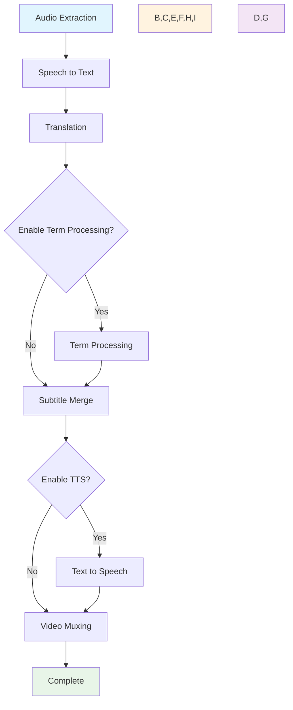

# 🎬 视频字幕AI处理系统

基于LangGraph的智能化视频字幕生成和处理系统，支持从视频到双语字幕的完整流水线。

## ✨ 核心特性

- 🤖 **智能工作流**: 基于LangGraph的状态管理和错误恢复
- 🎯 **端到端处理**: 从视频到双语字幕的完整流水线
- 🚀 **硬件加速**: 支持Apple Silicon MPS加速
- 🐳 **容器化开发**: 完整的Dev Container环境
- 🧪 **测试完备**: 单元测试和集成测试
- 📦 **现代化**: 使用pyproject.toml和现代Python工具链

## 🔄 处理工作流



## 🚀 快速开始

### 环境要求

- Python 3.10+
- FFmpeg (可选，用于音频处理)
- PyTorch (可选，用于AI模型)

### 安装

```bash
# 克隆项目
git clone <repository-url>
cd video-subtitle-agent

# 创建虚拟环境
python3 -m venv .venv
source .venv/bin/activate  # Linux/Mac
# 或 .venv\Scripts\activate  # Windows

# 安装依赖
pip install -e .

# 运行演示
python demo.py

# 运行测试
pytest tests/
```

### 基础使用

```python
from video_subtitle_agent import VideoSubtitleAgent

# 基础配置
agent = VideoSubtitleAgent(config={
    "device": "auto",                    # 自动检测设备
    "enable_tts": True,                  # 启用文本转语音
    "enable_term_processing": True,      # 启用术语处理
    "term_dictionary_path": "terms.csv", # 术语词典路径
    "max_retries": 3,                    # 最大重试次数
    "log_level": "INFO"                  # 日志级别
})

# 处理单个视频
result = agent.process_video(
    input_path="input.mp4",
    output_path="output_with_subtitles.mp4"
)

# 批量处理
results = agent.process_batch(
    input_paths=["video1.mp4", "video2.mp4"],
    output_dir="./outputs/"
)
```

### 命令行使用

```bash
# 启动Web GUI界面 (推荐)
video-subtitle gui
video-subtitle gui --host 0.0.0.0 --port 8080 --share

# 或者使用独立启动脚本
python launch_gui.py
python launch_gui.py --host 0.0.0.0 --port 8080 --share

# 处理单个视频
video-subtitle process input.mp4 --output output.mp4 --enable-tts

# 批量处理
video-subtitle batch ./videos/ ./outputs/ --recursive --device mps

# 仅生成字幕
video-subtitle subtitles input.mp4 --output subtitles.srt

# 查看系统信息
video-subtitle info

# 显示工作流程图
video-subtitle workflow
```

### Web GUI界面

启动Web界面后，您可以：

1. **拖拽上传视频文件** - 支持 MP4, AVI, MOV, MKV, FLV 格式
2. **配置处理参数** - 选择设备、启用TTS、调整重试次数等
3. **实时查看进度** - 显示处理进度和状态
4. **预览字幕结果** - 查看英文、中文和双语字幕
5. **复制字幕内容** - 一键复制生成的字幕文本


## 🏗️ 项目结构

```
video_subtitle_agent/
├── core/                   # 核心模块
│   ├── agent.py           # 主要代理类
│   └── state.py           # 状态管理
├── nodes/                  # 处理节点
│   ├── audio_extraction.py
│   ├── speech_to_text.py
│   ├── translation.py
│   ├── term_processing.py
│   ├── subtitle_merge.py
│   ├── text_to_speech.py
│   └── video_muxing.py
├── utils/                  # 工具模块
│   ├── cache.py           # 缓存管理
│   ├── device.py          # 设备检测
│   ├── exceptions.py      # 异常定义
│   └── file_utils.py      # 文件工具
├── cli.py                 # 命令行接口
└── __init__.py
```

## 🧪 开发

### 运行测试

```bash
# 运行所有测试
pytest tests/

# 运行特定测试
pytest tests/test_basic.py -v

# 生成覆盖率报告
pytest tests/ --cov=video_subtitle_agent --cov-report=html
```

### 代码格式化

```bash
# 格式化代码
black video_subtitle_agent/ tests/

# 排序导入
isort video_subtitle_agent/ tests/

# 代码检查
flake8 video_subtitle_agent/ tests/
```

## 🐳 容器化开发

项目支持使用OrbStack + Dev Container进行标准化开发环境：

1. 安装OrbStack
2. 在VS Code中安装Dev Containers扩展
3. 打开项目并选择"Reopen in Container"

## 📝 配置选项

| 配置项 | 默认值 | 描述 |
|--------|--------|------|
| device | auto | 计算设备 (auto/cpu/mps/cuda) |
| enable_tts | False | 是否启用文本转语音 |
| enable_term_processing | True | 是否启用术语处理 |
| max_retries | 3 | 最大重试次数 |
| log_level | INFO | 日志级别 |
| audio_sample_rate | 16000 | 音频采样率 |
| source_language | eng | 源语言 |
| target_language | cmn | 目标语言 |

## 🤝 贡献

欢迎提交Issue和Pull Request！

## 📄 许可证

MIT License

## 🔗 相关链接

- [LangGraph文档](https://langchain-ai.github.io/langgraph/)
- [LangChain文档](https://python.langchain.com/)
- [FFmpeg文档](https://ffmpeg.org/documentation.html)
